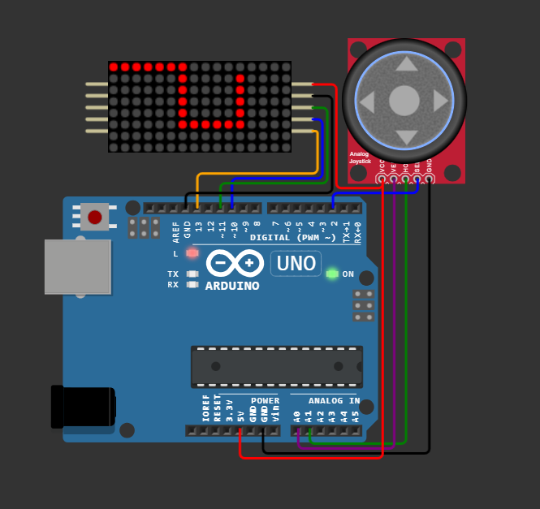

# AVR-MAX7219-SNAKE-PROJECT
## Arduino Etch A Sketch on 8x8 LED Matrices

### Description
This project is an Etch A Sketch game implemented on two 8x8 LED matrices controlled by a joystick and an Arduino. The game allows users to draw patterns on the LED matrices using the joystick.

## Table of Contents

- [Installation](#installation)
- [Usage](#usage)
- [Hardware Setup](#hardware-setup)
- [Compilation and Simulation](#compilation-and-simulation)
- [File Structure](#file-structure)
- [Contributing](#contributing)
- [License](#license)

## Installation

### Hardware Requirements
- Arduino board
- Two 8x8 LED matrices
- Joystick with select button

### Software Requirements


### Setup
1. Connect the LED matrices to the Arduino Uno board.
2. Connect the joystick to the Arduino Uno board.
3. Upload the code to the board.

## Usage
Move the joystick to draw on the LED matrices. Press the select button to clear the screen.

## Hardware Setup

### Joystick:
- **HORZ** is connected to Arduino Uno pin **A1**
- **VERT** is connected to Arduino Uno pin **A0**
- **SEL** is connected to Arduino Uno pin **D2**
- **GND** is connected to Arduino Uno pin **GND**
- **VCC** is connected to Arduino Uno pin **5V**

### Matrix:
- **CS** is connected to Arduino Uno pin **D10**
- **DIN** is connected to Arduino Uno pin **D11**
- **CLK** is connected to Arduino Uno pin **D13**
- **GND** is connected to Arduino Uno pin **GND**
- **VCC** is connected to Arduino Uno pin **5V**

## Compilation and Simulation

### Compiling to HEX File

1. Open a terminal and navigate to the project directory.
2. Make sure you have MinGW and the AVR toolchain installed and accessible from the terminal.
3. Run the following command to compile the code into a HEX file:

    ```bash
    mingw32-make all
    ```

    This will generate a HEX file in the `bin/debug` or `bin/release` directory, depending on the `DEBUG` flag setting in the Makefile.

### Uploading to Wokwi

1. Go to [Wokwi Project Link](https://wokwi.com/projects/296234816685212169).
2. Press F1 in the code area to get the pulldown menu
3. Write Firmware and choose 'Upload Firmware and Start Simulation'
4. Upload the generated HEX file to start the simulation.

### Additional Notes

- The Makefile uses the AVR toolchain located at `C:\avr\bin\`. Make sure to install it there or update the Makefile with the correct path.
- The `PORT` variable in the Makefile is set to `\\\\.\\COM3`. Update this if your Arduino is connected to a different COM port.
You can upload and simulate the project using this [Wokwi Project Link](https://wokwi.com/projects/296234816685212169).

## File Structure
* Makefile: Used for compiling and uploading the code.
* display.c and display.h: Handle the display logic for the LED matrices.
* joystick.c and joystick.h: Handle the joystick input.
* main.c: The main loop and setup for the Arduino.
* max72xx.c and max72xx.h: Libraries for controlling the MAX72xx LED driver.
* pin_defs.h: Definitions for pin configurations.
* uart.c and uart.h: Handle UART communication (if applicable).

## Contributing

1. Fork the project.
2. Create your feature branch (`git checkout -b feature/AmazingFeature`).
3. Commit your changes (`git commit -m 'Add some AmazingFeature'`).
4. Push to the branch (`git push origin feature/AmazingFeature`).
5. Open a pull request.

## License

This project is licensed under the MIT License
